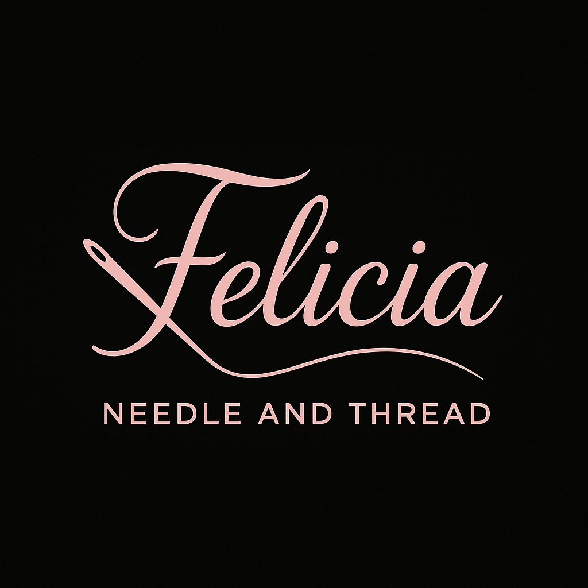

# Felicia’s Needle & Thread – Exam Project 1

A blog-style sewing site built as part of the final project exam. The project uses an API to fetch blog posts and includes multiple pages with styling and interactions.

## 🔗 Live Site
[https://flisa81.github.io/exam-project-final/](https://flisa81.github.io/exam-project-final/)

## 📁 Features
- Blog homepage with posts
- Post detail view
- Login, create, and edit post (UI only)
- Style guide (Figma)
- Desktop & mobile design (created in Figma)

## 💻 Technologies Used
- HTML
- CSS
- JavaScript
- Noroff API (v2)

## 🖼️ Preview

## 🚀 How to Run Locally
Clone the repo and open `index.html` in your browser. This is a static site.
